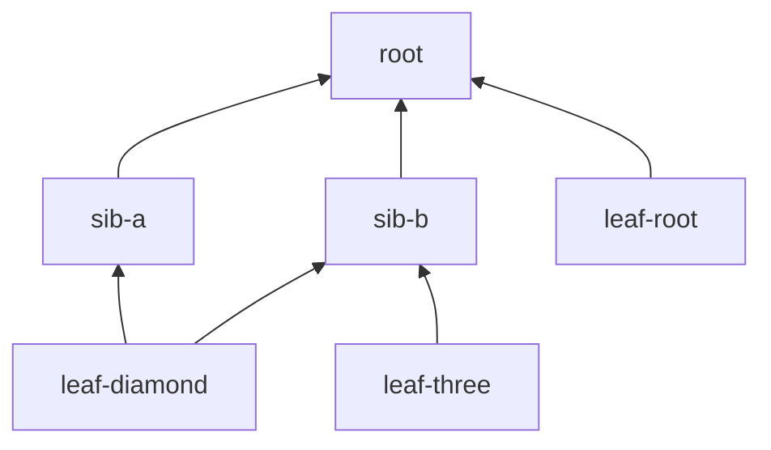

Demonstration of https://github.com/cerebrotech/bundle/tree/v3-capabilities

The bundles form a tree

```mermaid
graph BT
    sib-a --> root
    sib-b --> root
    leaf-root --> root
    leaf-diamond --> sib-a
    leaf-three --> sib-b
    leaf-diamond --> sib-b
```

